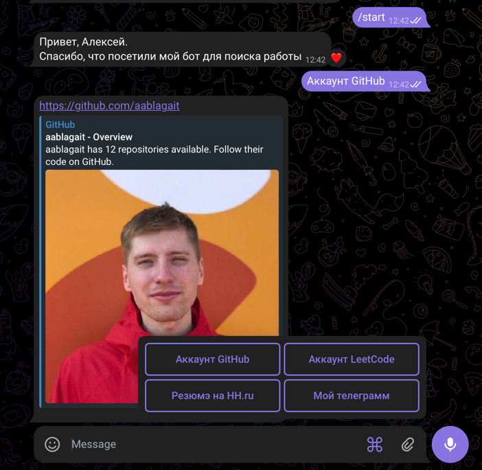

# CV Telegram bot
## О проекте
Привет, это мой пет-проект: телеграмм бот который 
присылает ссылки на мои резюмэ и аккаунты в соцсетях.
Я начинающий бэкэнд разработчик и буду рад обратной связи, 
полезным советам или предложения о работе.


## Быстрый старт
1. Склонируйте репозиторий на свой компьютер
2. Установите виртуальное окружение     
```python3 -m venv venv```  
 и активируйте его  
```source venv/bin/activate```
3. Установите библиотеки нужных версий  
```pip install -r requirements.txt```  
4. Запустите программу  
```python3 bot/bot.py```  


## Пример использования 


